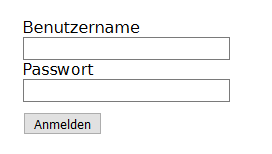
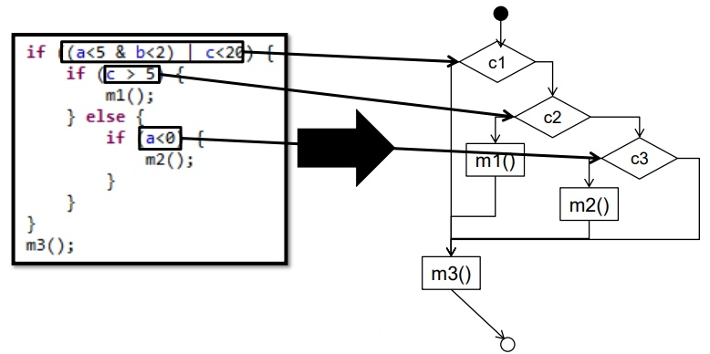
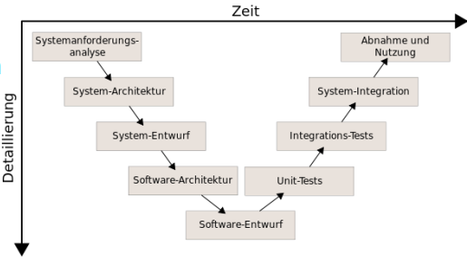
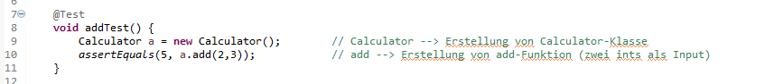

# Sollte ich als Informatiker mit Tests arbeiten?
Hallo, mein Name ist Mauricio Soltmann, ich bin 20 Jahre alt und studiere Informatik im fünften Bachelor Semester an der Otto-von-Guericke Universität Magdeburg. Im Rahmen des Kurses "Effiziente Programmierung und Ein-/Ausgabe" habe ich die Aufgabe bekommen mich im Laufe des Semesters mit dem Thema Tests auseinanderzusetzen und einen Vortrag darüber zu halten. Während meiner Recherche kam mir relativ früh die Frage in den Sinn, ob es sinnvoll ist, auch als Informatikstudent, Softwaretests in meine Programme einzubinden, auch wenn es nicht explizit verlangt wird. 
In den folgenden Abschnitten will ich euch meine Erkenntnisse zu Softwaretests näher bringen und zum Schluss zu einer gut durchdachten und logischen Antwort zur Frage "Sollte ich als Informatiker mit Tests arbeiten?" kommen.

### Was sind Softwaretests überhaupt?
Bevor wir tiefer in die Thematik einsteigen, will ich euch erstmal erklären, was Tests überhaupt sind. 
Tests prüfen und bewerten Software auf die Erfüllung der für ihren Einsatz definierten Anforderungen und missen ihre Qualität. Die gewonnenen Erkenntnisse werden zur Erkennung und Behebung von Softwarefehlern genutzt. Tests während der Softwareentwicklung dienen dazu, die Software möglichst fehlerfrei in Betrieb zu nehmen. 
Den Nachweis, dass keine Fehler mehr vorhanden sind, kann das Softwaretesten allerdings nicht erbringen. Das liegt daran, dass dafür alle Programmfunktionen und auch alle möglichen Werte in den Eingabedaten in allen ihren Kombinationen getestet werden müssten, was außer bei sehr einfachen Testobjekten praktisch nicht möglich ist. Deshalb ist das Ziel von Softwaretests mit einer möglichst geringen Anzahl von Testfällen eine möglichst große Testabdeckung zu erreichen.

### Welche Vorteile hat das Testen?
In großen Software Unternehmen ist das umfangreiche Testen von neuen Anwendungen Gang und Gäbe. Jetzt da wir wissen, was Softwaretests sind, schauen wir uns einige Vorteile an, die das Testen zu bieten hat und warum es in vielen Projekten eingesetzt wird.

**Software Testing spart Zeit und Geld**

Die Softwareentwicklung besteht normalerweise aus vielen Phasen, egal ob man einen statischen Projektplan hat oder ein agiles Projekt mit vielen Sprints und wenn Fehler in den frühen Phasen entdeckt werden, ist es meist günstiger, diese zu beheben, als wenn der Fehler erst später entdeckt wird. Im schlimmsten Fall muss dann nämlich der ganze Code nochmal durchsucht und umgeschrieben werden, um den Fehler zu beheben.

**Mehr Sicherheit**

In der Vergangenheit gab es viele Situationen, in denen Benutzerinformationen gestohlen wurden oder Hacker sie gefunden und zu ihrem Vorteil genutzt haben. Durch Security-Testing erhält der Nutzer ein vertrauenswürdiges Produkt, da solche Probleme und Risiken bereits im Vorfeld erkannt und noch während der Entwicklung beseitigt werden.

**Bessere Produktqualität**

Wenn eine Anwendung aktualisiert und um neue Funktionen erweitert werden soll, kann es schnell zu neuen Fehlern oder Bugs führen. Hat man jedoch ein umfassendes Test-Framework benutzt beim Entwickeln, findet man schnell heraus worin der Fehler liegt und kann ihn beheben.

**Höhere Kundenzufriedenheit**

Außerdem ist eine höhere Kundenzufriedenheit bei der Entwicklung einer Anwendung sehr wichtig. Mithilfe von Tests kann die Konsistenz von Anforderungen über den gesamten Produktlebenszyklus hinweg sichergestellt werden und man kann seinen Kunden die Funktionalität von verschiedenen Funktionen vorführen (vorallem mit Black Box Tests) bevor die Anwendung fertig entwickelt wurde, was zusätzlich das Vertrauen des Kunden stärkt.

### Manuelles Testing vs. Automatisiertes Testing
Als nächstes erkläre ich euch den Unterschied zwischen dem manuellen und dem automatisiertem Testen und vergleiche beide Ansätze.
Manuelle Tests werden von einem Menschen durchgeführt, der sich durch die Anwendung klickt oder mit der Software und APIs und entsprechenden Tools interagiert. Sie können durchgeführt werden, um Fehler während der Softwareentwicklung zu entdecken, aber auch um Feedback über die Benutzerfreundlichkeit und Vorschläge, wie die Anwendung verbessert werden könnte zu erhalten. Der Tester folgt dann einem mehr oder weniger strikten Ansatz, um jede Funktion des Systems zu verifizieren/testen. Nach der Ausführung der Testfälle verfasst er dann einen Testbericht.
Automatisiertes Testen hingegen stützt sich auf kodierte Test Skripte, bei denen das Testwerkzeug erwartete Ergebnisse mit tatsächlichen Ergebnissen vergleicht. Die Testskripte werden vom Tester geschrieben. Das Werkzeug selbst generiert dann einen Testbericht, der sowohl auf Schritt- als auch auf Skriptebene auf Erfolg oder Misserfolg hinweist, so dass der Tester schnell feststellen kann, ob die Anwendung wie erwartet funktioniert oder nicht.

**Manuelle und automatisierte Tests im Vergleich:**

| Manuelles Testing	| Automatisiertes Testing |
| :---: | :----: |
| zeitaufwändiger, benötigt menschliche Ressourcen für jeden Schritt |	deutlich schneller, erfordert außer der anfänglichen Skriptkodierung keine Ressourcen |
| Code ist besser nachvollziehbar (da sich der Tester mehr mit dem Code beschäftigt) |	keine zufälligen oder explorativen Tests möglich |
| menschliche Fehler, vorallem bei sich wiederholenden Aufgaben	| zuverlässiger, da es menschliche Fehler vermeidet |
| Änderungen können leichter eingearbeitet werden	| jede Änderung im Skript muss codiert werden 
| | spart langfristig viel Zeit und Budget in großen Software-Projekten |

Wie ihr seht haben beide Ansätze ihre Vor- und Nachteile. Abschließend kann man jedoch sagen, dass automatisiertes Testen in großen Softwareprojekten langfristig viel Zeit und Geld spart und daher häufiger verwendet wird. Außerdem behält man immer einen guten Überblick über die gesamte Anwendung und bemerkt sofort, wann und wo ein Fehler auftritt. Handelt es sich jedoch um eine kleine Anwendung oder es kommt zu häufigen Änderungen von Funktionen, kann manuelles Testen effizienter sein.

### Black Box und White Box Testing
Nun schauen wir uns zwei weitere Ansätze an, nach denen man Tests unterscheidet, nämlich nach Black Box und White Box Tests.

**Black Box Test**

Black Box Tests sind Tests, bei denen das interne Systemdesign nicht berücksichtigt wird und für den Tester unbekannt bleibt. Typischerweise interagiert ein Tester während der Durchführung eines Black Box Tests mit der Benutzeroberfläche des Systems oder einer anderen Schnittstelle, indem er Eingaben bereitstellt und Ausgaben untersucht. Dabei weiss er nicht wie und wo die Eingaben bearbeitet werden. Anhand der Anforderungen werden verschiedene Testfälle abgeleitet.

 

Um das Ganze zu veranschaulichen stellen wir uns eine Anwendung mit einer Login-Funktion vor (siehe oben). Unsere Aufgabe als Tester ist es nun folgende Anforderungen an das Login-Fenster zu testen:
1. bei richtigem Benutzernamen und Passwort soll der Nutzer eingeloggt werden
2. bei richtigem Benutzernamen und falschem Passwort soll die Meldung „falsches Passwort“ erscheinen
3. bei falschem Benutzernamen soll die Meldung „Benutzername existiert nicht“

Aus diesen drei Anforderungen leiten wir als Tester nun drei Testfälle, also Benutzername-Passwort Kombinationen, ab. Diese geben wir dann nacheinander in das Login-Fenster ein und gucken, ob das von uns erwartete Verhalten erzeugt wird.

**White Box Test**

Der White Box Test hingegen basiert auf dem Wissen über die interne Logik des Codes einer Anwendung. Um White Box Tests für eine Anwendung durchführen zu können, muss ein Tester die interne Funktionsweise des Codes kennen. Anhand des Codes werden dann verschiedene Testfälle abgeleitet.

 

Als Beispiel gucken wir uns den obenstehenden Pseudo-Code an, bestehend aus drei if-Schleifen und drei Funktionen, die aufgerufen werden können. Diesen Pseudo-Code können wir in einen Kontrollflussgraphen (rechts im Bild) umwandeln. Jede Raute repräsentiert dabei eine if-Schleife, die das Programm jeweils in zwei verschiedene Verläufe aufteilt (if-Bedingung erfüllt und if-Bedingung nicht erfüllt). Jedes Rechteck repräsentiert eine Funktion, die aufgerufen wird. 
Aus diesem Kontrollflussgraphen leiten wir als Tester nun unsere Testfälle, also jeweils Zahlen für a,b und c, ab. Das machen wir, indem wir uns für jeden möglichen Pfad durch den Kontrollflussgraphen einen Testfall überlegen. In unserem Beispiel wären das vier Pfade, also vier Testfälle:
1. c1 --> m3()
2. c1 --> c2 --> m1() --> m3()
3. c1 --> c2 --> c3 --> m2() --> m3()
4. c1 --> c2 --> c3 --> m3()

### Teststufen
Als Nächstes betrachten wir verschiedene Teststufen, die während eines Softwareprojekts durchlaufen werden.

Oben in der Abbildung seht ihr, wie so ein Softwareprojekt ungefähr aussehen könnte. Man fängt an mit einer Systemanforderungsanalyse, in der man alle Anforderungen an die Anwendung ableitet und geht dann immer detaillierter rein. Man entwirft die System-Architektur, den System-Entwurf, Software-Architektur bis man dann einen Software Entwurf hat. Danach fängt man an kleine Sachen zu testen, die Tests werden dann aber immer umfassender.

**Unit-Test**

Der einfachste Test ist der Unit-Test. Er erfolgt nah an der Quelle der Anwendung und dient zum Testen einzelner Methoden und Funktionen. Unit-Tests lassen sich kostengünstig automatisieren und können sehr schnell durchgeführt werden.

**Integrationstest**

Die nächste Stufe ist der Integrationstest. Mit Integrationstests wird sichergestellt, dass verschiedene Module oder Services problemlos ineinandergreifen. So kann beispielsweise die Interaktion mit der Datenbank oder das Zusammenspiel von Mikroservices getestet werden. Tests dieser Art sind kostspieliger, weil dafür mehrere Teile der Anwendung funktionsfähig sein müssen.

**Systemtest**

Der Systemtest prüft das gesamte Software-System auf die gestellten Anforderungen und auf die Tauglichkeit zur Abnahme. Der Test findet auf einer Testumgebung statt und wird mit Testdaten durchgeführt. Die Testumgebung soll die Produktivumgebung des Kunden simulieren, also ihr möglichst ähnlich sein. In der Regel wird der Systemtest durch die realisierende Organisation durchgeführt.

**Akzeptanztest**

Ein Akzeptanztest ist das Testen der gelieferten Software durch den Kunden. Der erfolgreiche Abschluss dieser Teststufe ist meist Voraussetzung für die rechtswirksame Übernahme der Software und deren Bezahlung. Besonders für  Akzeptanztests wird das Blackbox-Verfahren angewendet, da hier vor allem Echtdaten und richtige Benutzereingaben getestet werden.

### Test Driven Development
Als nächstes schauen wir uns das sogenannte Test Driven Development an und hierbei handelt es sich um eine Methode Software zu programmieren, die sich sehr stark auf Tests stützt. Unzwar werden beim Test Driven Development zuerst die Testskripte geschrieben und danach erst die benötigten Klassen und Funktionen programmiert. Es gibt dabei 4 Schritte, die man durchläuft unzwar für jede Funktionalität oder Anforderung an die Anwendung. Gehen wir die vier Schritte anhand eines einfachen Beispiels einmal durch. In unserem Beispiel wollen wir eine Taschenrechner Anwendung programmieren und sollen eine Funktion „add“ implementieren, die in der Lage ist zwei Zahlen zusammenzuaddieren:

**1. Überlege wünschenswertes Verhalten**

Unsere Funktion „add“ soll zwei ganzzahlige Zahlen zusammenaddieren und das Ergebnis der Addition zurückliefern.

**2. Schreibe einen Testfall, der dieses Verhalten erzeugt**

In unserem Testskript überprüfen wir jetzt unser gewünschtes Verhalten, indem wir zwei Zahlen an unsere Funktion „add“ übergeben und den Rückgabewert mit unserem erwarteten Ergebnis vergleichen. Im folgenden Bild sieht man, wie das aussehen könnte. Hier hab ich das ganze mithilfe von JUnit erstellt, einem Test-Framework für Unit-Tests in Java Programmen. 

 

Zunächst wird ein Calculator Objekt erstellt. Dann wird die Funktion „add“ mit den Werten 2 und 3 aufgerufen. Der Rückgabewert dieses Funktionsaufrufes wird dann mit unserem erwarteten Ergebnis 5 verglichen. Ist der Rückgabewert gleich 5, gibt der Test den Wert true zurück, ist er nicht gleich 5, gibt der Test den Wert false zurück.

**3. Schreibe Code, der den Testfall nicht mehr fehlschlagen lässt**

Zum jetzigen Zeitpunkt existiert unsere Anwendung und die Funktion „add“ noch nicht. Das heißt, dass der Test, den wir geschrieben haben, fehlschlägt. Nun kommt unsere Programmierung ins Spiel. Die ist jedoch um ein Vielfaches einfacher, da unser Testskript uns schon alle Klassen und Funktionen vorgibt, die wir brauchen werden. Aus unserem Beispiel können wir ableiten, dass wir eine Klasse „Calculator“ benötigen und eine Funktion „add“ in der Klasse „Calculator“. Das Einzige, was wir jetzt noch tun müssen, ist den Code für die Funktion „add“ zu schreiben, sodass sie uns das richtige Ergebnis zurückliefert. Wenn wir das getan haben können wir unser Testskript nochmal starten und sehen direkt, ob unsere Funktion mit den Werten, die wir übergeben, funktioniert.

**4. Verbessere den Code durch Refactoring**

Falls man nach der Programmierung noch Testfälle entdeckt, die fehlschlagen, kann man seinen Code nochmal umschreiben oder verbessern.
Das gezeigte Beispiel ist ziemlich simpel gehalten und ich denke jeder von uns ist in der Lage eine einfache Additionsfunktion zu implementieren ohne das Ganze testen zu müssen. Jedoch kann diese Methode vorallem bei komplexeren Anwendungen mit vielen verschiedenen Klassen und Methoden sehr hilfreich sein. Beim Test Driven Development macht man sich vor der Programmierung Gedanken über die Struktur des Programms. Das verhindert dann, dass man gleich drauf losprogrammiert und sich irgendwann nicht mehr zurechtfindet.

### Sollte ich als Informatiker mit Tests arbeiten?
Kommen wir zu meinem abschließenden Fazit. Ich muss zugeben, dass ich bisher sehr wenig Erfahrungen mit Tests hatte. Wenn ich mal eine Programmieraufgabe zu erledigen hatte, habe ich immer ohne Testsoftware daran gearbeitet. Das führte in einigen Fällen, vor allem bei größeren Programmen, dazu, dass ich den Überblick über alle Klassen und Funktionen verlor. Bei auftretenden Fehlern wusste ich auch gar nicht, wo ich anfangen sollte mit Suchen und war letztendlich nur noch frustriert.

Gerade um solche Situationen zu verhindern, macht es Sinn mit Tests zu arbeiten. Ein umfangreiches Testframework sorgt dafür, dass man immer einen guten Überblick über seine Funktionalitäten im Programm behält und nach Änderungen im Code alles direkt testen kann. Dadurch bemerkt man sofort wann und wo sich Fehler einschleichen und kann diese dann gezielt beheben. Es gibt viele Software Erweiterungen für nahezu jede Programmiersprache, sodass man Testskripte relativ einfach in seine Programmierumgebung miteinbinden kann. Der einzige Nachteil, der sich durch das Testen ergibt, ist ein erhöhter Programmieraufwand um die Testskripte zu schreiben und diese bei Änderungen von Funktionen nochmal umzuschreiben.

Meiner Meinung nach überwiegen die Vorteile von Softwaretests ganz klar die Nachteile. Deshalb denke ich, dass man sich bei größeren, komplexeren Programmieraufgaben oder Anwendungen auf jeden Fall vorher Gedanken um ein passendes Testframework machen sollte. Bei kleineren, weniger komplexen Anwendungen ist das meiner Meinung nach jedoch nicht unbedingt nötig. 

### Mit welchen Testframeworks kann ich starten?
Zum Abschluss möchte ich euch noch einige Softwareprogramme bzw. -erweiterungen vorstellen, mit denen ihr eure ersten Testframeworks aufbauen könnt. Die erste und bekannteste Software ist Selenium. Selenium ist ein Framework für automatisierte Softwaretests von Webanwendungen. Es ist weit verbreitet und unterstützt Sprachen, wie Java C#, JavaScript, Python, Python, Ruby, Perl und viele weitere. Eine weitere Testautomatisierungssoftware ist Appium, sie dient zum Testen von mobilen Webanwendungen. Sie unterstützt nahezu jede Programmiersprache und außerdem cross platform automation, dieselben Tests funktionieren also auch auf verschiedenen Plattformen. Zum Schluss empfehle ich euch noch JUnit, was ich im Abschnitt „Test Driven Development“ schon ein wenig angerissen habe. JUnit dient zum Testen von Java Programmen mithilfe von Unit Tests.
Alle drei Programme sind kostenlos und Open Source, also könnt ihr sie gerne mal ausprobieren, wenn ich euch überzeugen konnte in eurem nächsten größeren Projekt mit Tests zu arbeiten.
